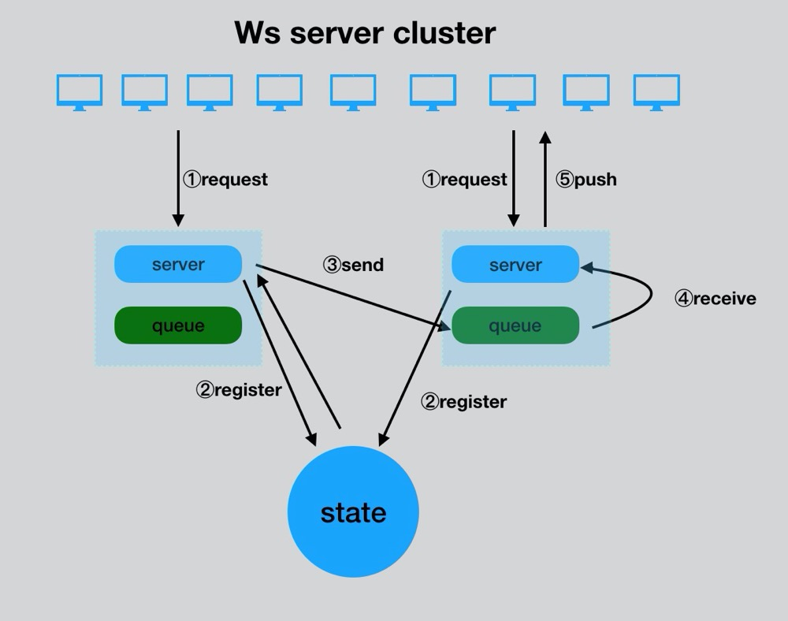
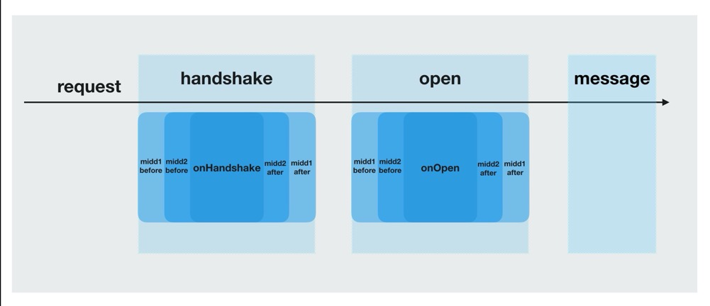

# swoft websocket cluster

1\. 介绍
----------------

基于swoole websocket server的swoft websocket已经很方便的开箱即用，但其无法直接支持多机器集场。

本组件可支持大多数web推送场景，IM互聊场景，IM群发场景等。

使用前请通读[Swot webdocket Server文档](https://www.swoft.org/documents/v2/core-components/websocket)，配置习惯与其并无任何变化。

流程请参见下图



- ① 客户端发起握手请求并建立连接
- ② 当前服务端向资源管理State注册并绑定当前用户信息
- ③ 服务端A向服务B所在消息队列推送消息
- ④ 服务端B消费消息并接收
- ⑤ 服务端B向客户端推送消息


2\. 特性
----------------
- 高性能，水平扩容
- 高可用，所有机器都为master，相互心跳检测
- 消息队列与状态管理均采用适配器模式，默认均为redis驱动，拓展性强
- 事件均采用Aop切面技术,无感知，解耦
- 与原```Swoft Webdocket```使用起来基本一致，习惯保持

3\. 安装
----------------
### composer

```
composer require devweyes/ws-server-cluster
```

### redis

默认使用redis内存服务器作为状态保存，消息队列。所以你还需至少一台redis服务器或集群

4\. 使用
----------------

### 基本使用

使用命令，```WsModule```，```消息控制器```，```消息解析器``` 请参见[Swot webdocket Server文档](https://www.swoft.org/documents/v2/core-components/websocket)

一个完整的```WsModule```需配置全部已知方法注解，用于实现切面。包括```@OnHandshake()```.```@OnOpen()```.```@OnMessage()```.```@OnClose()``` ,```@OnMessage()```可由```消息控制器```代替，否则可能无法正常使用。

### 集群配置

默认配置，如需自定义可覆盖。

```php
<?php

        return [
            Cluster::MANAGER => [  //主配置
                'class' => ClusterManager::class,
                'state' => bean(Cluster::STATE),  //状态选择
                'onHandshakeMiddleware' => [ //握手阶段中间键
                    bean(DefaultAllowMiddleware::class)
                ],
                'onOpenMiddleware' => [ //onOpen阶段中间键
                    bean(DefaultAuthMiddleware::class)
                ],
                'heartbeat' => 60 //服务器心跳检测，相互检测
            ],
            Cluster::STATE => [ //状态保存配置
                'class' => RedisState::class,
                'redis' => bean('redis.pool'),
                'serializer' => bean(Cluster::SERIALIZER),
                'prefix' => 'swoft_ws_server_cluster',
            ],
            Cluster::SERIALIZER => [  //序列化配置
                'class' => PhpSerializer::class
            ]
        ];
```


bean.php添加异步进程消息处理

```php
<?php

use Jcsp\WsCluster\Helper\Tool;
...
'wsServer' => [
    'class' => \Swoft\WebSocket\Server\WebSocketServer::class,
    ...
    //可配置多个消息消费，视业务量而定
    'process' => array_merge(
                Tool::moreProcess('recvMessageProcess', bean(\Jcsp\WsCluster\Process\RecvMessageProcess::class), 3),
                [
                  //自定义进程
                ]
            )
]
...

```
bean.php添加消息控制器中间键（```如有用到消息控制器，此选项必须```）

```php
<?php
···
    'wsMsgDispatcher' => [
        'preMiddlewares' => [
            \Jcsp\WsCluster\Middleware\RecvMessageMiddleware::class
        ]
    ],
···
```
### 新增中间键概述




### onHandshakeMiddleware 中间键

- 只需在主配置添加```onHandshakeMiddleware```集合，即可优雅完成```@OnHandshake```处的处理。此中间键集合一般可用作请求过滤等业务。
- 类需继```Jcsp\WsCluster\Middleware\AbstracHandshakeMiddleware```

- 方法```before```为入，```after```为出，所有中间键先入后出顺序，参数与```@OnOpen```一致。
- 如需阻断，则需```return [false, $response]```,```$response```可垮中间键传输

```php
<?php

namespace Jcsp\WsCluster\Middleware;

use Swoft\Bean\Annotation\Mapping\Bean;
use Swoft\Http\Message\Request;
use Swoft\Http\Message\Response;

/**
 * @Bean()
 * Class DefaultAllowMiddleware
 * @package Jcsp\WsCluster\Middleware
 */
class DefaultAllowMiddleware extends AbstracHandshakeMiddleware
{
    /**
     * @param Request $request
     * @param int $fd
     */
    public function before(Request $request, Response $response)
    {
        if(!$request->getHeaderLine('auth')) {
            //return [false, $response];
        }
        return [true, $response->withAttribute('allow','true')];
    }
    /**
     * @param Request $request
     * @param int $fd
     */
    public function after(Request $request, Response $response)
    {

    }
}


```

### onOpenMiddleware 中间键

- 只需在主配置添加```onOpenMiddleware```集合，即可优雅完成```@OnOpen```处的处理。此中间键一般用作处理用户绑定，头部token解析等逻辑。
- 类需继```Jcsp\WsCluster\Middleware\AbstractOpenMiddleware```

- 方法```before```为入，```after```为出，所有中间键先入后出顺序，参数与```@OnOpen```一致。


内置用户绑定中间键，替换此中间键一般需实现```Cluster::register```用于用户绑定

```php
<?php

namespace Jcsp\WsCluster\Middleware;

use Jcsp\WsCluster\Cluster;
use Swoft\Bean\Annotation\Mapping\Bean;
use Swoft\Http\Message\Request;

/**
 * @Bean()
 * Class DefaultAuthMiddleware
 * @package Jcsp\WsCluster\Handle
 */
class DefaultAuthMiddleware extends AbstractOpenMiddleware
{
    /**
     * @param Request $request
     * @param int $fd
     */
    public function before(Request $request, int $fd)
    {
        //token解析+用户绑定
        $auth = $request->getHeaderLine('auth');
        if ($auth) {
            Cluster::register($fd, $this->decodeToken($auth));
        }
    }
    /**
     * @param Request $request
     * @param int $fd
     */
    public function after(Request $request, int $fd)
    {
      //出
    }
    private function decodeToken(string $auth)
    {
        return $auth;
    }
}

```
### 消息推送Api
Swoft对单机推送的支持，详见 [Swot webdocket Server消息推送Api](https://www.swoft.org/documents/v2/core-components/websocket/#heading14)。

Cluster支持对所有服务器的任意客户端直推消息

```php
<?php
//对绑定的uid精准推送，@onOpen中间键绑定
Cluster::transport(string $message, $uid = null)

Cluster::transportToUid(string $message, ...$uid)
```
```php
<?php
//对所有在役服务端的客户端广播消息
Cluster::transportToAll(string $message)
```

### 内置事件

消息接收
```Jcsp\WsCluster\Event::RECV_MESSAGE```

用户注册
```Jcsp\WsCluster\Event::REGISTER```

用户注销
```Jcsp\WsCluster\Event::LOGOUT```

server服务心跳
```Jcsp\WsCluster\Event::DISCOVER```

server服务离线
```Jcsp\WsCluster\Event::SHUTDOWN```
